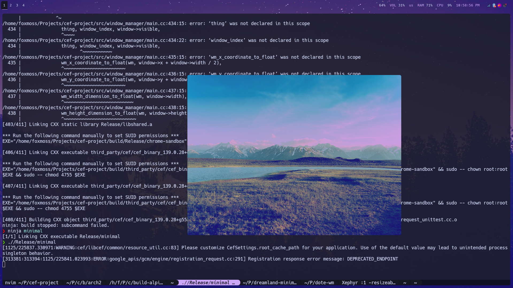
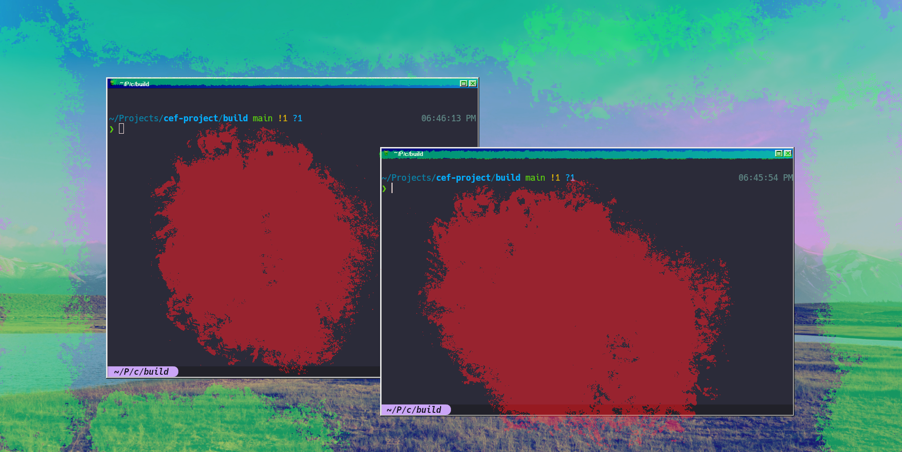
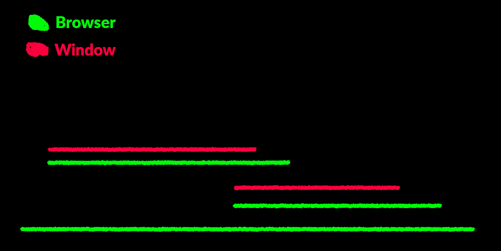

# A Web Browser Controls My X11 Window Manager

This is an image of my window manager with full X11 support as well as border decorations,
background, and window interactions be handled by a web browser.


Let me explain.

## A Primer

To display a program window an operating system uses a window display server. On Linux this is mainly 
X11 written by MIT in 1984, it's old and starting to show it's age and Wayland is taking some of X11
market share. So you can display a window but to get the nice behavior of movement and resizing
buttons and keybinds, we need a window manager. This is a separate program that the display server
consults on how it should render and handle the windows. Then all the windows need to know is how to
talk to the display server and all the window manager needs to know is how to handle the windows.
This is a lovely system which allows for window managers to take on all different kinds of shapes
sizes and appearances while maintaining compatibility.

The goal of the project was to decrease the skill needed to write a fully customized window manager.
I've been aware of many projects that try to do the very opposite of this project for a while, i.e.
put the desktop environment into the web, with some decent success. See [puter](https://puter.com/)
and [AnuraOS](https://github.com/MercuryWorkshop/anuraOS) for two great examples of such projects.
It's quite a bit easier to tweak CSS constants and JS snipets then it is to change style embedded
already in a long standing modern desktop/window manager. So lets bring the web to the desktop and
have a browser control the system. That's the pitch and that's what we're going to do.

## The Browser

So how do we actually pull off this magic trick. I started with the web browser because I figured
this would be the hardest bit. We need to communicate with the Javascript process while
keeping access to low level interfaces as to interact with our windows. Then the other requirement
is being able to serve our webpage without a HTTPS request leaving our computer. 

How? CEF.

CEF also known as Chromium Embedded Framework is a multiplatform framework for writing web apps for
desktop with a nice C++ interface to boot. Like Electron but slightly lower level, it provides the
functionality we need while abstracting the actual browser process away in an easy to download
binary. So to load our files off the user's machine we can right a custom scheme. Like where the
traditional chromium browser has chrome:// we can do the same using a interface CEF provides.

```c++
// ...
  // registers dote://base/
  CefRegisterSchemeHandlerFactory("dote", "base",
                                  new ClientSchemeHandlerFactory(sock));
// ...
```

And the actual code for finding and returning the file is fairly simple. Just read the file out of
the `~/.config/dote/` directory and if there is none return a 404. We also have some basic and
a quick dirty and flawed file extension based MIME type generator. I won't bore you with the code,
check out the repo if you want an exact idea of the implementation.

Cool a browser window!

Here I just give the `body` tag a `background-image` to act as a wallpaper.

## The Layer Cake

So now that we can load HTML and Javascript files we now have a nice neat secure sandbox,
unfortunately we need to let it control our machine. I consider writing a web socket implementation
to work over the scheme, but what is much easier is to use the CefQuery primitive. I'm unsure what
the intended use case was supposed to be, but it just exposes a function to Javascript that calls a
C++ function:

```c++
class MessageHandler : public CefMessageRouterBrowserSide::Handler {
 public:
  explicit MessageHandler(int sock) : ipc_sock(sock) {}

  int ipc_sock;

  bool OnQuery(CefRefPtr<CefBrowser> browser,
               CefRefPtr<CefFrame> frame,
               int64_t query_id,
               const CefString& request,
               bool persistent,
               CefRefPtr<Callback> callback) override {
    // i prefer std::optional where possible but nlohmann throws exceptions occasionally
    try {
      nlohmann::json from_browser = nlohmann::json::parse(request.ToString());

      // ...

      callback->Success(to_browser.dump());
    } catch (const std::exception& e) {
      callback->Failure(-1, std::string(e.what()));
    }
    return true;
  }

 private:
  DISALLOW_COPY_AND_ASSIGN(MessageHandler);
};

```

Then on the browser side we can just tell the browser to call this function every frame and we have
a basic event loop.

```ts
// send the browser start message in the first call
let message_queue: WindowDataSegment[] = [{ t: "browser_start" }];
let message_back_buffer: WindowDataSegment[] = [];

let start: DOMHighResTimeStamp;
function step(timestamp: DOMHighResTimeStamp) {
  if (start === undefined) {
    start = timestamp;
  }
  state.elapsed = timestamp - start;

  message_back_buffer = message_queue;
  message_queue = [];

  window.cefQuery({
    request: JSON.stringify(message_back_buffer),
    onSuccess: (response: string) => {
      // flush queue
      message_back_buffer  = [];

      const response_parsed = JSON.parse(response) as WindowDataSegment[];
      for (let segment in response_parsed) {
        // ...
      }
    },
    onFailure: function (_error_code: number, _error_message: string) {
      // message parsing error likely cause the bug
      message_queue = [];
    },
  });

  requestAnimationFrame(step);
}

requestAnimationFrame(step);
```

I was at first very skeptical of the performance of this, there *was* no way this would be able to
run in real-time. But my mentality has always been shoot first optimize later, and well the basic event
loop is still in the codebase so it's been good enough for my standards so far.

Now for that we have that we have the browser and a bit of the actual client working the next
component was the window manager. I'm going to need to do some tricks with rendering later down the
line which will get to but the only reasonable choice here was to write a compositing window
manager. Compositing just means instead of letting the display server do all the work, we get the
textures from the display sever and render it to the screen ourselves in this case with the 3D
graphics pipeline OpenGL. We're also doing this in X11 because Xlib is fairly easy to write and lets
me experiment more quickly.

We now live in a weird world now of vibe coding and the knowledge of the inner workings of
processes being sprung from the aether, so I want to give credit where credit is due. The window
manager portion is a soft fork of [x-compositing-wm](https://github.com/obiwac/x-compositing-wm/) by
obiwac then rewritten by hand in C++ with a modern semi error tolerant style. The original project is
slightly broken in some areas but it provided a good basis on how X11 can interact with OpenGL. 

This I keep as a separate process from the browser on the basis of implementing escape hatches. If
the browser hangs, I would want to be able implement features where we can kill windows or implement
a simple rudimentary backup for debugging or rebooting your browser process. The downside of
implementing it this way is that now we have another event loop. 

```c++
void DoteWindowManager::run() {
  glDepthFunc(GL_LESS);
  glEnable(GL_DEPTH_TEST);
  glEnable(GL_BLEND);
  glBlendFunc(GL_SRC_ALPHA, GL_ONE_MINUS_SRC_ALPHA);

  while (true) {
    while (process_events())
      ;
    glClearColor(1, 1, 1, 1);
    glClearDepth(1.2);
    glClear(GL_COLOR_BUFFER_BIT | GL_DEPTH_BUFFER_BIT);

    ipc_step();
    for (auto window : windows) {
      render_window(window.second.window);
    }

    glXSwapBuffers(display, output_window);
  }
}
```
(A note on naming: we're calling the window manager Noko internally because why not, the framework as a
whole is called Dote.)

So now we need to communicate up the chain from window manager to browser. There's a billion and one
ways of doing Inter-Process Communication I like `nanomsg`. The interface is going to be very
familiar if you've done a Berkeley sockets loop before.

```c++
    if ((ipc_sock = nn_socket(AF_SP, NN_PAIR)) < 0) {
      printf("ipc sock failed\n");
    }
    if (nn_bind(ipc_sock, "ipc:///tmp/noko.ipc") < 0) {
      printf("ipc bind failed\n");
    }

    // non-blocking
    int to = 0;
    if (nn_setsockopt(ipc_sock, NN_SOL_SOCKET, NN_RCVTIMEO, &to, sizeof(to)) <
        0) {
      printf("ipc non_block failed\n");
    }
```

`nanomsg` will just be abstracting local file based UNIX sockets here, especially in the PAIR
configuration (one to one). But it makes some memory management easier especially since we're
dealing with variably sized buffers.

Protobuf is another technology that seems to end up in nearly every single one of my projects, but I
can't help myself writing traditional binary serialization is annoying. Plus we get free type
annotations which beats using JSON. 

So combined we end up with a fairly simple Protobuf over nanomsg protocol, with the structure
looking like this.

```protobuf
message DataSegment {
  oneof data {
    WindowMapReply window_map_reply = 2;
    WindowMapRequest window_map_request = 3;

    // ...
  }
}

message Packet {
  repeated DataSegment segments = 1;
}
```

Every time we need to proxy a new event we just add a new segment data type.

Requests are from the browser, replies are from the window manager. We don't have a strict request
reply structure, with event's being fired at any time but it's useful to frame all action in the
context of the JS developer. All interactions should be at least initiated by Javascript when it comes to
managing the state of things.
 


## The Protocol in action

To initiate, CEF just sends the browser X11 window id down to the window manager and we can place it
in the back and fullscreen it to make it appear as if the browser is our wallpaper.

Now just writing some protocol buffers we can now send some X11 events up and down the chain and let
the web page do whatever it so chooses with out windows.

So lets make some window decorations! We can quite simply define a window frame in Javscript and let
the user drag it around to drag the underlying window. Though you might have just thought of a major
problem with this, what happens if the window overlaps? We can reorder the OpenGL windows quite
easily just by changing the depth of the vertices we render them at, but the underlying browser
window can't be both in front of and behind a window. Or can it? 

This is my reasoning behind making a compositing manager, because when we're really just rendering
textures to a polygon we can get creative with it. So first we need a quad to work with which we can
clone from the real windows and apply the browser window's textures to. But like that we get a
heavily warped view of the actually big browser window. That's because right now we're just trying
to use the entire texture so we need to apply some cropping.

Here's how accomplish the task:

```c++
    // borders are defined in offset to the window
    uint32_t pixel_border_width =
        window->width - window->border->x + window->border->width;
    uint32_t pixel_border_height =
        window->height - window->border->y + window->border->height;

    // convert from pixel space to open gl space
    float border_x = x_coordinate_to_float(window->border->x + window->x +
                                           pixel_border_width / 2);
    float border_y = y_coordinate_to_float(window->border->y + window->y +
                                           pixel_border_height / 2);
    float border_width = width_dimension_to_float(pixel_border_width);
    float border_height = height_dimension_to_float(pixel_border_height);

    glUniform2f(cropped_position_uniform, border_x, border_y);
    glUniform2f(cropped_size_uniform, border_width, border_height);
```


```glsl
// vertex shader
#version 330

layout(location = 0) in vec2 vertex_position;
out vec2 local_position;

uniform float depth;
uniform vec2 position;
uniform vec2 size;
uniform vec2 cropped_position;
uniform vec2 cropped_size;

void main(void) {
    local_position = vertex_position;

    gl_Position = vec4(
        vertex_position * (cropped_size / 2) + cropped_position,
        depth,
        1.0
    );
}
```

We shrink the window the cropped size, and position we want. On a normal window the crop is simply
the normal size of the window. The divided by 2 is from the OpenGL behavior that the center of the
screen is (0, 0), with the screen space scaling from (-1, 1), to (1, -1) making the total width of
rectangle scaling the whole screen 2. 

```glsl
// fragment shader
#version 330

in vec2 local_position;
out vec4 fragment_colour;

uniform float opacity;
uniform sampler2D texture_sampler;
uniform vec2 position;
uniform vec2 size;
uniform vec2 cropped_position;
uniform vec2 cropped_size;

void main(void) {
    vec2 uncroped_position = (
        local_position / ((size / 2) / (cropped_size / 2)) 
        - position 
        + cropped_position
    );
    
    vec4 colour = texture(
        texture_sampler,
        uncroped_position * vec2(0.5, -0.5) + vec2(0.5)
    );
    
    float alpha = opacity * colour.a;
    fragment_colour = vec4(colour.rgb, alpha);
}
```

Then here actually sample the texture. If size, and position are equivalent to cropped_size and
cropped_position the terms cancel out. Then if cropped size is smaller the size grows how we sample
the texture to account for the smaller quad size size. Hurts my head a little, took a hot second to
figure out on a whiteboard.

So now we can just put our cropped base window to act as a frame in between another window and the
window it frames. 

In pictures:




Weirdly complex for something that seems so simple!

On the browser end, we can just give it a command to define these raised window borders.

```ts
  message_queue.push({
    t: "window_register_border",
    window: window_map_reply.window,
    x: -BORDER_BASE,
    y: -BORDER_WIDTH + -BORDER_BASE,
    width: BORDER_BASE,
    height: BORDER_BASE,
  } as WindowRegisterBorderRequest);
```

Then when we handle interactions we just pass all click events that would go to a border to the base
window instead of the window the user is actually hovering according to X.

The last technical hurdle is window icons. Window icons are provided to the window manager by X in an
uncompressed array of RGBA values. Which for obvious reasons isn't easy to process by a browser, so
we first need to convert the image to a PNG. Then to send it over Protobuf and subsequently JSON I
put it into data base64 url format for the added benefit of being able to be passed directly into a
src= attribute.

## Some Musings

There's two major places I would consider taking the project, you might have noticed how very
modular the project is. You can easily replace any of the 3 layers and have the other's still
behave. So in that vain I would be interested in trying to switch out the X11 compositing for
Wayland compositing. Wayland being the newer cooler window display server that's trying to obsolete
X11. From my observations and single attempt the libraries and ecosystem for Wayland aren't ready
for quick prototyping and rapid development. The other part I would like to attempt to switch out is
the browser, we can get some syncing delay as the browser either tries to catch up with the window
manager or the window manager tries to catch up with the browser. These problems could be side
stepped with greater control of the Javascript engine and frame rendering, so possibly a full
Chromium or Ladybird fork may help out.

So that's about it for the technical details. Go try it out, check [the GitHub](https://github.com/FoxMoss/DoteWM)
for updated install instructions and go forth and write your own window manager.

Shout out to [Midnight by HackClub](https://midnight.hackclub.com/) for encouraging me to make this
project!


